# Claver HR — Project Plan

## Overview

Claver HR is a multi-tenant HR management platform. It allows companies to manage open roles, receive candidate applications through a public-facing job board, and track candidates through a custom per-role hiring pipeline.

---

## Monorepo Structure

```
/
├── apps/
│   ├── api/          # Node.js + Express + Prisma backend
│   └── web/          # Next.js frontend (dashboard + public job board)
├── packages/
│   └── shared/       # Shared TypeScript types, Zod schemas, utilities
├── package.json
├── tsconfig.json
└── PLAN.md
```

---

## Tech Stack

| Layer | Technology |
|---|---|
| Frontend | Next.js (App Router) |
| Backend | Node.js + Express |
| Database | PostgreSQL via Prisma ORM |
| Auth | JWT (access + refresh tokens) |
| File Storage | AWS S3 (with per-company scoped access) |
| Shared | TypeScript types + Zod schemas in `packages/shared` |

---

## Database Schema (Prisma)

### `Company`
- `id` — Int, PK
- `name` — String (display name, e.g. "Oversight")
- `slug` — String, unique (URL-safe identifier, e.g. "oversight")
- `description` — String?
- `heroImageUrl` — String? (S3 URL)
- `logoUrl` — String? (S3 URL)
- `createdAt`, `updatedAt`

### `User`
- `id` — Int, PK
- `companyId` — FK → Company
- `name` — String
- `username` — String, unique
- `email` — String, unique
- `passwordHash` — String
- `role` — Enum: `admin` | `user`
- `createdAt`, `updatedAt`

### `Role` (called "Templates" in current UI)
- `id` — Int, PK
- `companyId` — FK → Company
- `createdByUserId` — FK → User
- `name` — String
- `description` — String?
- `location` — String?
- `type` — Enum: `full_time` | `part_time` | `hybrid` | `remote`
- `seniorityLevel` — String?
- `requirements` — String[] (array of strings)
- `isActive` — Boolean, default true
- `customFields` — Json (array of CustomField objects, see below)
- `stages` — Stage[] (relation)
- `createdAt`, `updatedAt`

### `Stage`
- `id` — Int, PK
- `roleId` — FK → Role
- `name` — String (e.g. "Phone Screening", "Technical Interview")
- `order` — Int (for ordering stages in the pipeline)
- `createdAt`, `updatedAt`

### `Application`
- `id` — Int, PK
- `roleId` — FK → Role
- `companyId` — FK → Company (denormalized for fast querying)
- `currentStageId` — FK → Stage? (null = not yet placed in pipeline)
- `formData` — Json (key-value pairs matching the role's customFields)
- `resumeS3Key` — String? (S3 object key for the uploaded resume)
- `createdAt`, `updatedAt`

### `RefreshToken`
- `id` — Int, PK
- `userId` — FK → User
- `token` — String, unique
- `expiresAt` — DateTime
- `createdAt`

---

## CustomField Object (JSON shape, defined in `packages/shared`)

A `CustomField` is a JSON object stored in `Role.customFields` (array). It describes how to render an HTML form field:

```ts
type CustomField = {
  id: string;           // unique field key, e.g. "personalNote"
  label: string;        // display label, e.g. "Personal Note"
  type: "text" | "textarea" | "email" | "tel" | "url" | "file" | "checkbox" | "select";
  required?: boolean;
  placeholder?: string;
  options?: string[];   // for "select" type only
}
```

`full_name` and `email` are always implicitly present in every application form. Everything else comes from `customFields`.

---

## S3 File Storage Strategy

### Bucket Structure
All files live in a single S3 bucket with a structured key namespace:

```
companies/{companyId}/applications/{applicationId}/{fieldId}/{filename}
companies/{companyId}/assets/hero/{filename}
companies/{companyId}/assets/logo/{filename}
```

### Access Control
- **Company assets** (hero image, logo): Public read. Uploaded via a pre-signed PUT URL generated by the API. The resulting URL is stored in the DB.
- **Application files** (resumes, etc.): **Private by default**. Never publicly accessible via S3 directly.
  - To view a resume, the frontend requests a **pre-signed GET URL** from the API (`GET /api/applications/:id/files/:fieldId`).
  - The API validates that the requesting user belongs to the same company as the role the application was submitted to before generating the pre-signed URL.
  - Pre-signed URLs expire after 15 minutes.
- **Upload flow for applications**: The public form POSTs to the API. The API receives the file, streams it to S3 under the correct private key, stores the S3 key in the DB.

### Summary of Rules
| File Type | S3 ACL | Access Method |
|---|---|---|
| Company hero/logo | Public | Direct S3 URL stored in DB |
| Resume / application file | Private | Pre-signed URL via API (auth required) |

---

## Authentication

- JWT-based with **access token** (short-lived, 15min) + **refresh token** (long-lived, 7 days, stored in `RefreshToken` table).
- Refresh tokens are rotated on each use (old token invalidated, new one issued).
- All dashboard/admin routes require a valid access token in the `Authorization: Bearer` header.
- The public job board (`/[companySlug]` and `/[companySlug]/[roleId]`) requires no auth.
- Application submission requires no auth.

---

## API Structure (`apps/api`)

### Public Routes (no auth)
```
GET    /api/public/:companySlug                  # Get company info + active roles
GET    /api/public/:companySlug/roles/:roleId    # Get single role details + customFields
POST   /api/public/:companySlug/roles/:roleId/apply  # Submit an application (multipart/form-data)
```

### Auth Routes
```
POST   /api/auth/login          # Login → returns access + refresh token
POST   /api/auth/refresh        # Refresh access token
POST   /api/auth/logout         # Invalidate refresh token
```

### Dashboard Routes (JWT required)

**Company**
```
GET    /api/company             # Get own company info
PATCH  /api/company             # Update company name, slug
POST   /api/company/hero        # Upload hero image (returns pre-signed URL or handles upload)
POST   /api/company/logo        # Upload logo image
```

**Users** (admin only for create/delete)
```
GET    /api/users               # List users in company
POST   /api/users               # Create new user
PATCH  /api/users/:id           # Update user
DELETE /api/users/:id           # Delete user
POST   /api/users/:id/message   # Send message to user (stub for now)
```

**Roles**
```
GET    /api/roles               # List all roles for company
POST   /api/roles               # Create role
GET    /api/roles/:id           # Get role details
PATCH  /api/roles/:id           # Update role
DELETE /api/roles/:id           # Delete role
PATCH  /api/roles/:id/active    # Toggle active status
```

**Stages**
```
GET    /api/roles/:roleId/stages         # List stages for a role
POST   /api/roles/:roleId/stages         # Create stage
PATCH  /api/roles/:roleId/stages/:id     # Update stage (name, order)
DELETE /api/roles/:roleId/stages/:id     # Delete stage
```

**Applications**
```
GET    /api/applications                        # List all applications for company (with filters)
GET    /api/applications/:id                    # Get single application details
DELETE /api/applications/:id                    # Delete application
PATCH  /api/applications/:id/stage              # Move application to a stage
GET    /api/applications/:id/files/:fieldId     # Get pre-signed URL for a file field
GET    /api/applications/export                 # Export applications as CSV
```

**Super Admin Routes** (system owner only — no UI, API only)
```
POST   /api/admin/companies          # Create a new company
POST   /api/admin/companies/:id/users  # Create first user for a company
```
Super admin is identified by a separate env-based secret token (not JWT), e.g. `X-Admin-Secret` header.

---

## Frontend Structure (`apps/web`)

### Public Pages (no auth, part of Next.js app)
```
/[companySlug]                  # Public job board — company header + open roles list
/[companySlug]/[roleId]         # Single role page — description, requirements, application form
```

### Dashboard Pages (auth required)
```
/login                          # Login page
/dashboard                      # Dashboard home (stats, charts, recent applications)
/dashboard/applications         # Applications list with search + filter
/dashboard/applications/[id]    # Single application detail view
/dashboard/roles                # Roles list
/dashboard/roles/new            # Create new role
/dashboard/roles/[id]/edit      # Edit role (including stages and custom fields)
/dashboard/users                # Users management
/dashboard/settings             # Company settings (name, slug, hero, logo, admins)
```

### Layout Notes
- Public pages: minimal layout — company hero header, clean white content area.
- Dashboard pages: sidebar navigation (Dashboard, Applications, Roles, Users, Settings) + top bar.
- Dashboard is protected via middleware that checks for a valid JWT.

---

## `packages/shared` Contents

```
packages/shared/
├── types/
│   ├── company.ts       # Company, CompanyPublic
│   ├── user.ts          # User, UserRole
│   ├── role.ts          # Role, CustomField, FieldType
│   ├── stage.ts         # Stage
│   └── application.ts   # Application, ApplicationStatus
├── schemas/
│   ├── role.ts          # Zod schemas for create/update role
│   ├── application.ts   # Zod schema for application submission
│   ├── user.ts          # Zod schema for create/update user
│   └── company.ts       # Zod schema for company settings
└── index.ts             # Re-exports everything
```

---

## Implementation Phases

### Phase 1 — Foundation
- [ ] Set up Prisma schema with all models
- [ ] Run initial migration
- [ ] Set up Express app with basic middleware (cors, helmet, body-parser)
- [ ] Set up `packages/shared` with core types and Zod schemas
- [ ] Super admin API routes (create company, create first user)
- [ ] Auth routes (login, refresh, logout)
- [ ] JWT middleware for protected routes

### Phase 2 — Core Dashboard API
- [ ] Company routes (get, update, upload assets)
- [ ] Users routes (CRUD)
- [ ] Roles routes (CRUD, toggle active)
- [ ] Stages routes (CRUD per role)
- [ ] S3 service — helper functions for pre-signed URLs, upload, delete

### Phase 3 — Applications API
- [ ] Public API routes (company info, roles list, role detail)
- [ ] Application submission endpoint (multipart, file upload to S3)
- [ ] Applications dashboard routes (list, detail, move stage, delete, export CSV)
- [ ] Pre-signed URL endpoint for viewing private files

### Phase 4 — Frontend Dashboard
- [ ] Next.js app setup with App Router
- [ ] Auth flow (login page, JWT storage in httpOnly cookie or memory, middleware protection)
- [ ] Dashboard layout (sidebar, top bar)
- [ ] Dashboard home page (stats cards, charts)
- [ ] Roles list + create/edit role pages (including dynamic custom fields builder and stages editor)
- [ ] Applications list page (search, filter by role)
- [ ] Application detail page (form data display, resume viewer via pre-signed URL, stage mover)
- [ ] Users page (list, add, delete)
- [ ] Settings page (company name, slug, hero/logo upload)

### Phase 5 — Public Job Board
- [ ] `/[companySlug]` — company page with open roles
- [ ] `/[companySlug]/[roleId]` — role detail + dynamically rendered application form
- [ ] Form submission (handles file uploads, calls public API)
- [ ] Success/error states after submission

### Phase 6 — Polish
- [ ] Input validation on all API routes using Zod schemas from `packages/shared`
- [ ] Proper error handling and error response format across the API
- [ ] Slug uniqueness enforcement + slug suggestion on company creation
- [ ] S3 cleanup on application delete (remove files)
- [ ] CSV export for applications

---

## Key Business Rules

1. A **company slug** must be unique, URL-safe, lowercase, English only (like a username). Example: "oversight", "acme-corp". Validated with `/^[a-z0-9-]+$/`.
2. Users can only access data belonging to their own company. Enforced at the API middleware level.
3. Only `admin` role users can create/delete other users and change company settings.
4. Application files are **always private** — never expose S3 keys or direct S3 URLs to the frontend. Always go through the pre-signed URL endpoint.
5. Deleting a role should soft-delete or warn if it has existing applications.
6. Stages are ordered by `order` field. When a stage is deleted and applications reference it, `currentStageId` should be set to null on those applications.
7. A role's `customFields` define the form. `full_name` is always collected implicitly and stored separately in `Application.formData`.

---

## Screenshots / UI Reference

### Dashboard — Home
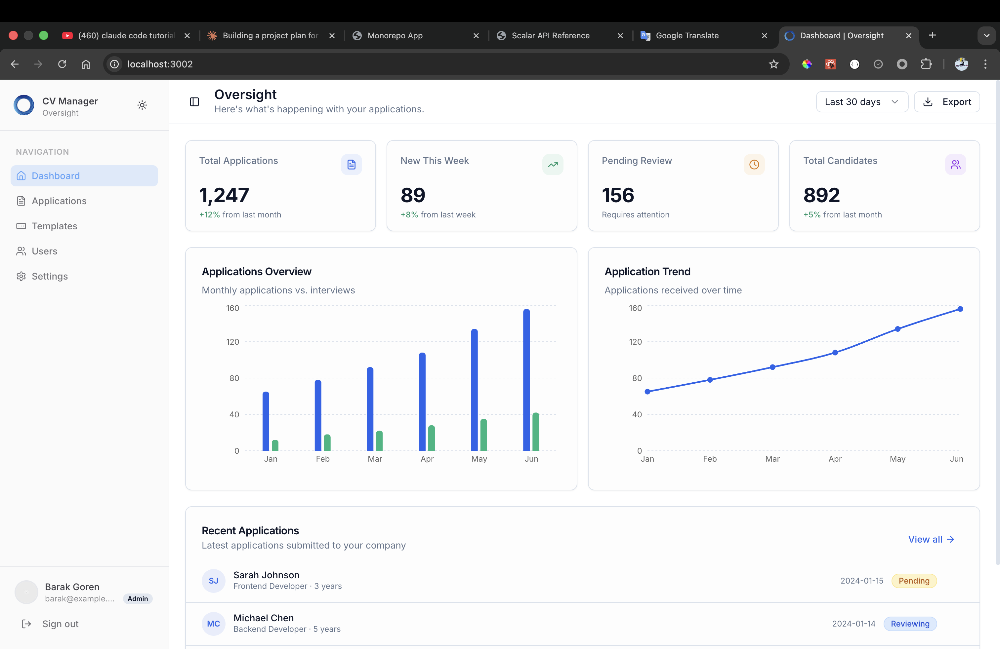

### Dashboard — Applications List
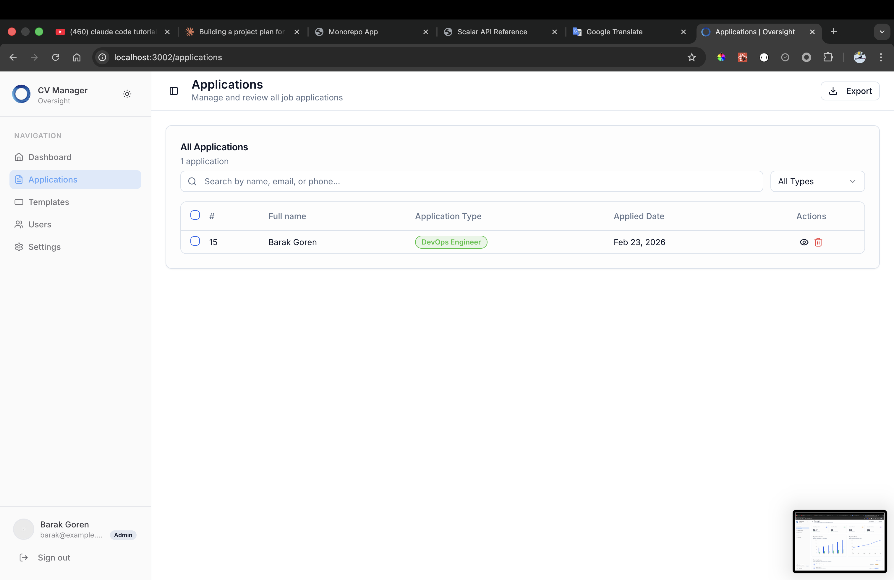

### Dashboard — Application Detail
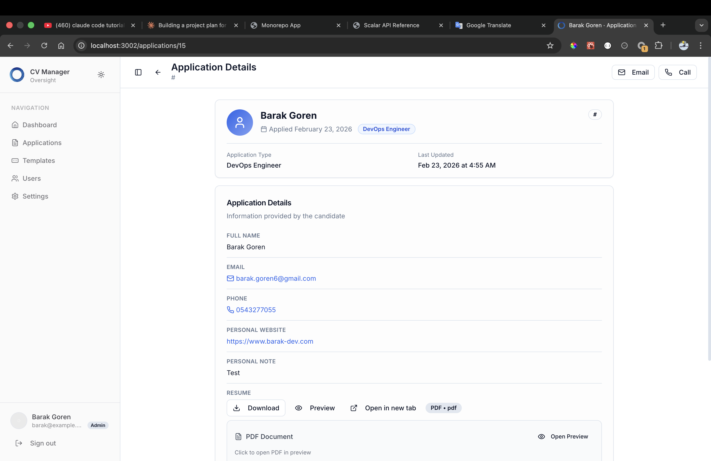

### Dashboard — Roles List
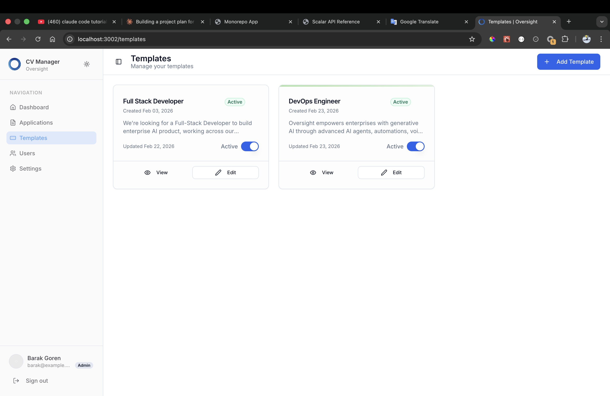

### Dashboard — Edit Role (Template Info)
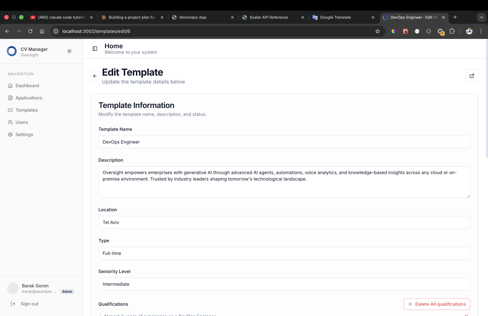

### Dashboard — Edit Role (Qualifications + Form Fields)
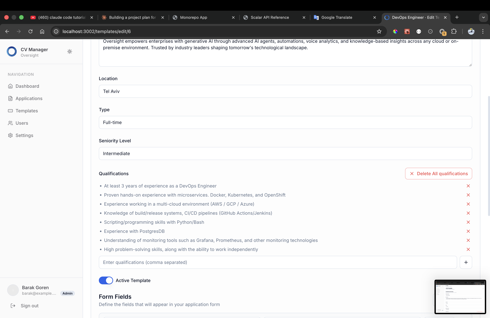
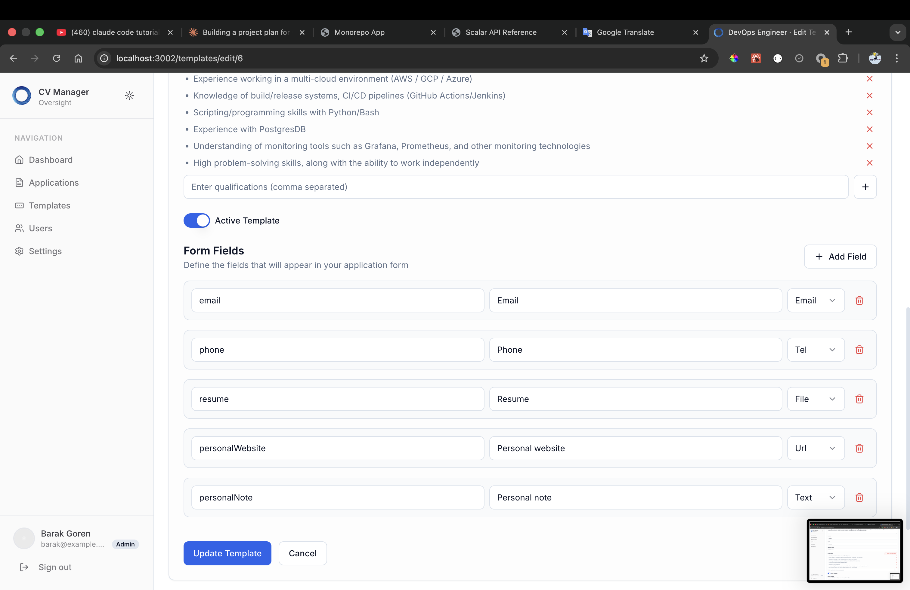

### Dashboard — Users
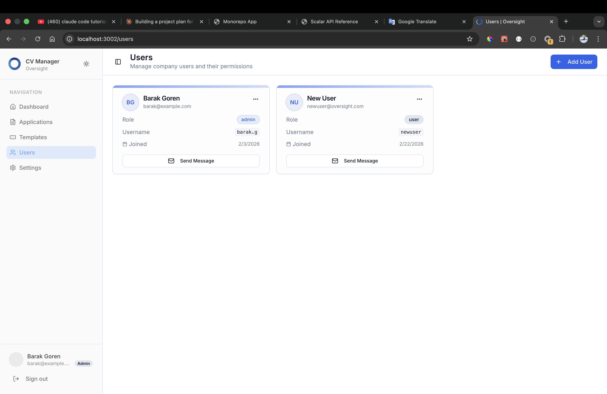

### Dashboard — Settings
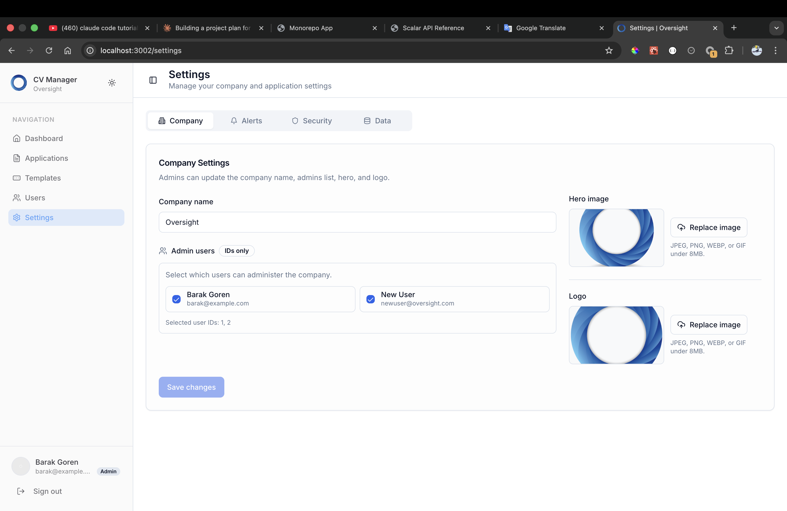

### Public — Company Job Board (`/[companySlug]`)
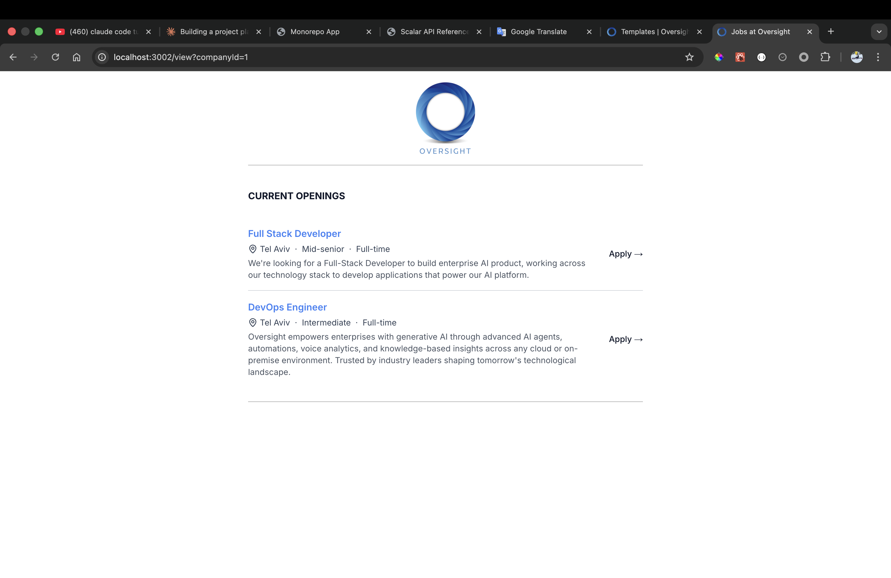

### Public — Role Detail + Application Form (`/[companySlug]/[roleId]`)
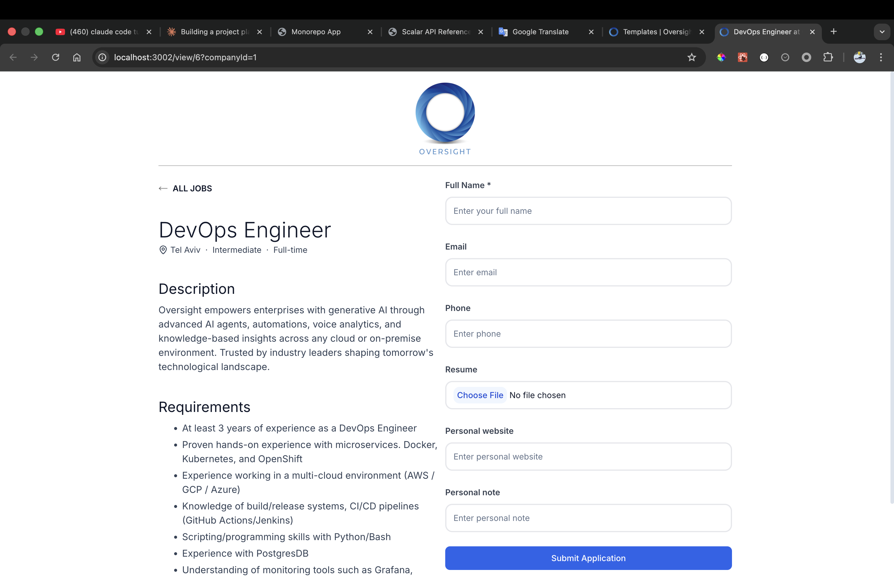

---

## Environment Variables

### `apps/api`
```
DATABASE_URL=
JWT_ACCESS_SECRET=
JWT_REFRESH_SECRET=
ADMIN_SECRET=
AWS_ACCESS_KEY_ID=
AWS_SECRET_ACCESS_KEY=
AWS_REGION=
AWS_BUCKET_NAME=
```

### `apps/web`
```
NEXT_PUBLIC_API_URL=
```